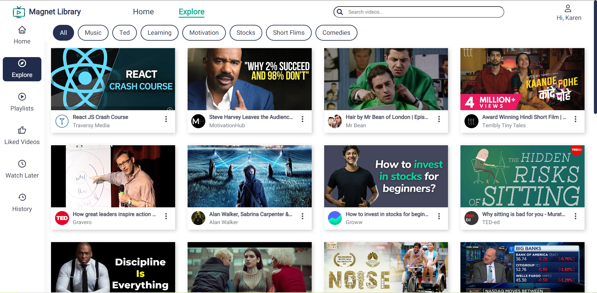
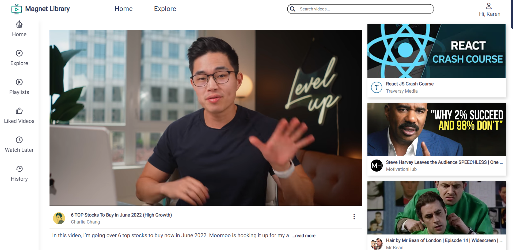
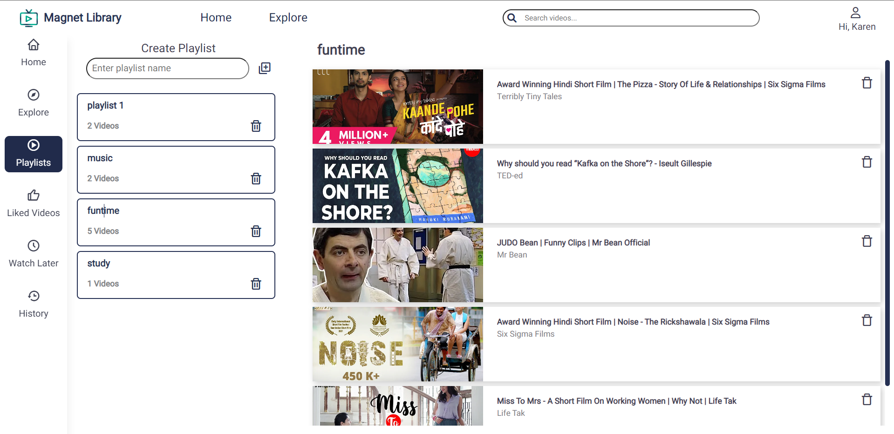
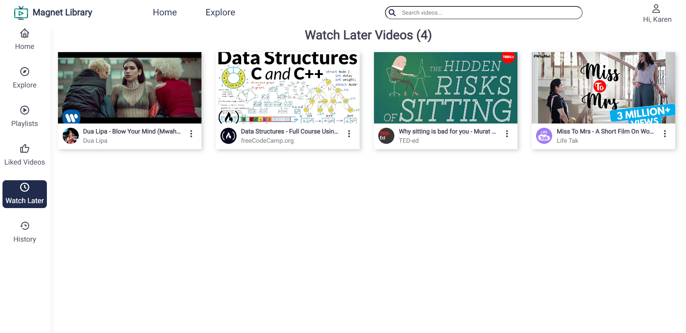
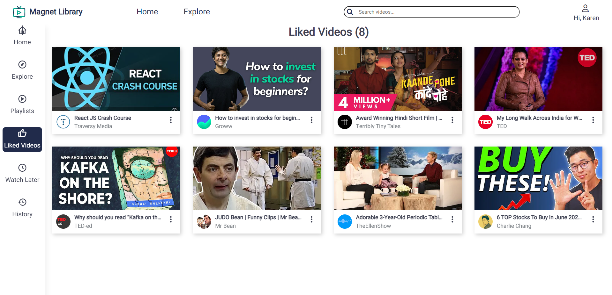
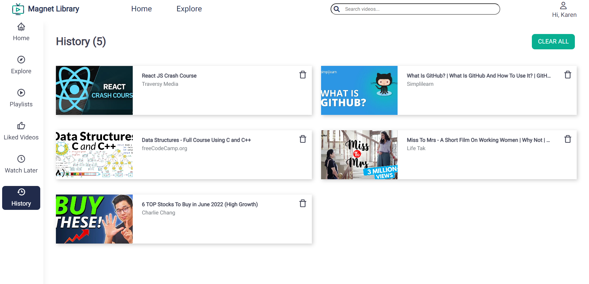

<div align="center">
  

## [Magnet Library](https://magnet-library.netlify.app/)

Magnet library is an on demand video viewing platform for all your content related needs. It has a wide range of genres available to watch from comedies to motivational. It has something to view for every age group.

## </div>

## How to run the app locally?

```
$ git clone https://github.com/KanekarSnehal/Magnet-Library.git
$ cd Magnet-Library
$ npm install
$ npm start
```

---

## Deployed Link

Checkout the live demo [here](https://magnet-library.netlify.app/)

---

## Built With

- ReactJS
- React Router
- React Context API + useReducer
- React Youtube for embedded player
- MagnetUI Component Library

---

## Features

- Landing page with featured categories
- Explore Page
  - List of videos to choose from
  - User can filter videos by various categories
  - User can like a video
  - User can add video to Watch Later
  - User can create a playlist and add video to playlist
- Search video
  - User can search video by category, title and creator name
- Single Video Page
  - User can play video which will get added to history
- Playlist Page
  - User can create a playlist
  - User can add videos to playlist
  - User can video a particular playlist
  - User can delete a video from playlist
  - User can delete a playlist
- Watch Later Page
  - User can add a video to watch later
- History Page
  - User view his/her history
- Liked Video Page
  - User can view his/her liked videos
- User Authentication
  - User Signup
  - User Login

---

## Screens







